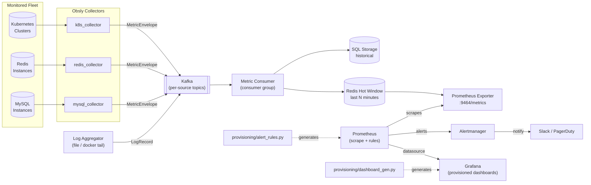

# Obsly — Fleet Observability Platform

Obsly is a Python platform that ingests metrics from Kubernetes clusters,
Redis, and MySQL over Kafka, stores and aggregates them, and automates
Prometheus/Grafana dashboard and alert provisioning — so reliable services
can run **unattended** across a fleet of Linux machines on AWS. It also
ships a log aggregator that normalizes host/container logs and ships them
alongside the metrics pipeline.

## What it does

- **Collects** metrics from three fleet sources on a fixed interval:
  - Kubernetes node/pod/deployment health via the Kubernetes API
  - Redis throughput/memory/replication via `INFO`
  - MySQL connections/queries/replication via `SHOW GLOBAL STATUS`
- **Streams** every reading through Kafka as a normalized `MetricEnvelope`,
  decoupling collection from processing so collectors and consumers scale
  independently.
- **Persists** ingested metrics to durable SQL storage (via SQLAlchemy) for
  history, and to a Redis-backed hot window for fast serving.
- **Exports** the hot window to Prometheus via a native `prometheus_client`
  HTTP endpoint.
- **Provisions** Prometheus recording/alerting rules and Grafana dashboards
  from Python (dashboards-as-code), so alert thresholds and panels stay
  reviewable and reproducible instead of hand-edited in the UI.
- **Aggregates logs** from files or Docker containers into normalized JSON
  records, shipped over the same Kafka backbone.
- **Deploys** the entire stack — Kafka, Prometheus, Alertmanager, Grafana,
  MySQL, Redis, and the Obsly services — with a single Docker Compose file.

## Architecture



**Flow summary:** collectors poll each fleet source and publish
`MetricEnvelope` messages onto per-source Kafka topics. A consumer group
reads every topic, writes durable history to SQL, and refreshes a
short-lived Redis "hot window." The Prometheus exporter reads that hot
window and republishes it as native Prometheus metrics; Prometheus scrapes
the exporter and evaluates alerting rules generated from
`obsly/provisioning/alert_rules.py`, routing firing alerts to Alertmanager
and on to Slack/PagerDuty. Grafana renders dashboards generated from
`obsly/provisioning/dashboard_gen.py` against the same Prometheus
datasource. The log aggregator ships normalized log lines over the same
Kafka backbone for correlation with metrics.

## Project layout

```
obsly/
  config.py              # env-driven settings for every subsystem
  logging_setup.py        # structured JSON logging shared by all services
  models/metric.py         # MetricEnvelope / LogRecord schema
  kafka/                   # topics, admin bootstrap, producer, consumer
  collectors/               # k8s / redis / mysql collectors + base run loop
  storage/                   # SQLAlchemy models + SQL/Redis repository
  exporter/                   # Prometheus exporter
  logs/                         # log aggregator (file/docker tailing)
  provisioning/                  # generates Prometheus rules + Grafana dashboards
  cli/                             # entrypoints: collect, consume, exporter, provision
deploy/
  docker-compose.yml       # full stack: Kafka, Prometheus, Grafana, Alertmanager, app
  prometheus/                # scrape config + generated alerting/recording rules
  alertmanager/                # routing config
  grafana/                       # datasource/dashboard provisioning + generated dashboards
tests/                            # unit tests for schema, topics, and alert rules
```

## Running it

### Prerequisites
- Docker + Docker Compose
- Python 3.11+ (only needed for local, non-Docker development)

### Full stack via Docker Compose

```bash
cd obsly
cp .env.example .env   # adjust Kafka/Redis/MySQL/AWS settings as needed
make compose-up
```

This builds the Obsly image and brings up Kafka, Redis, MySQL, Prometheus,
Alertmanager, Grafana, and the Obsly collector/consumer/exporter services.

- Prometheus: http://localhost:9090
- Alertmanager: http://localhost:9093
- Grafana: http://localhost:3000 (default admin/admin)
- Obsly Prometheus exporter: http://localhost:9464/metrics

Tear the stack down with:

```bash
make compose-down
```

### Local development (without Docker)

```bash
pip install -r requirements.txt
cp .env.example .env
python -m obsly.kafka.admin              # create Kafka topics
python -m obsly.cli.collect --source redis --once   # run one collection cycle
python -m obsly.cli.consume &             # start the consumer
python -m obsly.cli.exporter &            # start the Prometheus exporter
```

### Regenerating provisioning artifacts

Prometheus rules and Grafana dashboards are generated from Python, not
hand-edited. After changing `obsly/provisioning/alert_rules.py` or
`obsly/provisioning/dashboard_gen.py`, regenerate the checked-in YAML/JSON:

```bash
make provision
```

## Testing

Unit tests cover the metric schema, Kafka topic conventions, and the
generated Prometheus alert rules (no live Kafka/Kubernetes/Redis/MySQL
required):

```bash
make dev-install
make test
```

For an end-to-end smoke test against the full stack, bring the stack up
with `make compose-up` and check that `curl localhost:9464/metrics` returns
data once the collectors have run a cycle, and that dashboards under the
"Obsly" folder in Grafana render data from Prometheus.
